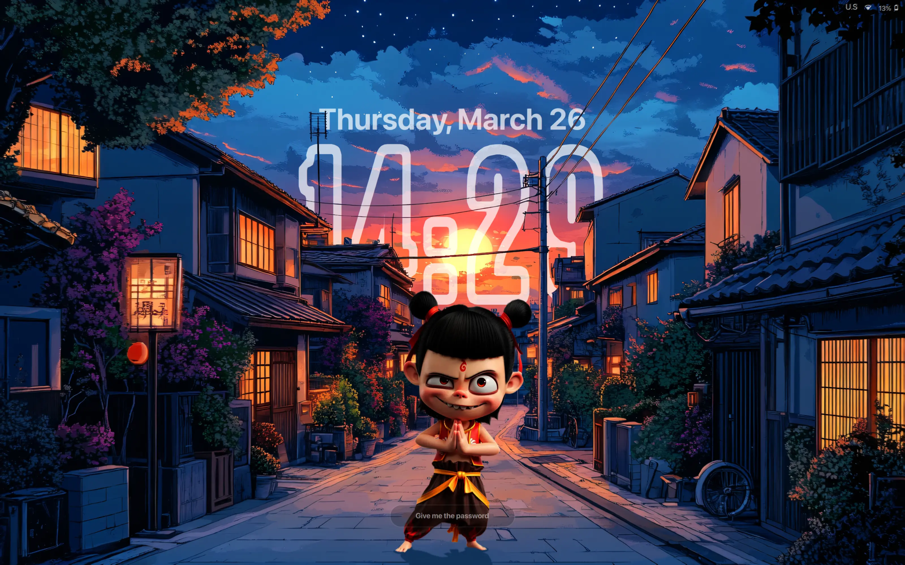

# neZha — Hyprlock Theme

A minimal, visually layered lock screen theme for [Hyprlock](https://github.com/hyprwulf/hyprlock), designed to pair with the [neZha SDDM Theme](https://github.com/tuklu/neZha-SDDM-Theme).



---

## Features

- Large typographic clock (Steelfish Outline)
- Day / month / date label
- Foreground image overlay for depth
- Password input field with custom placeholder
- Top-right system status bar: keyboard layout · network · volume · battery
- Integrates with [Omarchy](https://github.com/basecamp/omarchy) theme system

---

## Dependencies

| Tool | Purpose |
|------|---------|
| [hyprlock](https://github.com/hyprwulf/hyprlock) | Lock screen daemon |
| [hyprctl](https://wiki.hyprland.org/Hypr-Ecosystem/hyprctl/) | Keyboard layout detection |
| [iwctl](https://iwd.wiki.kernel.org/) | Wi-Fi status |
| [pamixer](https://github.com/cdemoulins/pamixer) | Volume status |
| Steelfish Outline font | Clock typeface |
| SF Pro Display Bold font | UI labels |
| Nerd Fonts | Status bar icons |

---

## Installation

1. Clone the repo:
   ```sh
   git clone https://github.com/tuklu/neZha-Hyprlock-Theme ~/.config/hypr/neZha-Hyprlock-Theme
   ```

2. Copy or symlink the config:
   ```sh
   cp ~/.config/hypr/neZha-Hyprlock-Theme/hyprlock.conf ~/.config/hypr/hyprlock.conf
   ```

3. Copy the scripts:
   ```sh
   cp ~/.config/hypr/neZha-Hyprlock-Theme/scripts/* ~/.config/hypr/scripts/
   chmod +x ~/.config/hypr/scripts/*.sh
   ```

4. Adjust background and foreground image paths in `hyprlock.conf` to match your setup.

---

## Related

**[neZha SDDM Theme](https://github.com/tuklu/neZha-SDDM-Theme)** — the matching login screen theme for SDDM. Use both for a consistent look from login to lock screen.

---

## License

[MIT](LICENSE) © tuklu
